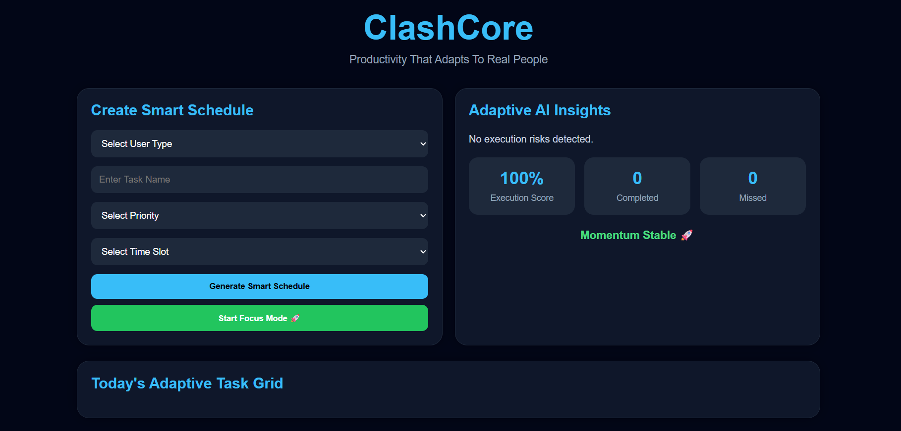

# ClashCore-EPL-26

Smart timetable generation system with adaptive conflict resolution.

## Product Overview

ClashCore is a smart scheduling and productivity tool that helps users manage tasks, avoid time conflicts, and stay focused on their daily goals.

It is designed for students, professionals, freelancers, entrepreneurs, and anyone who wants to organize their time better.

## Team Members
- Madhu Harini Maanthi
- Vaishnavi Sunkari

## UN SDG Alignment
ClashCore supports SDG 4: Quality Education.

By helping students plan and follow study schedules effectively, the project encourages better learning habits and time management.

## Tech Stack
- HTML
- CSS
- JavaScript 

## Features
- Smart Task Scheduling
- Time Conflict Detection
- Task Completion Tracking
- Missed Task Tracking
- Execution Score System
- Focus Mode Timer
- Responsive User Interface

## System Architecture

User

  ↓

Task Input

  ↓

Conflict Detection

  ↓

Task Management

  ↓

Execution Tracking

  ↓

Focus Mode
## Home Screen

